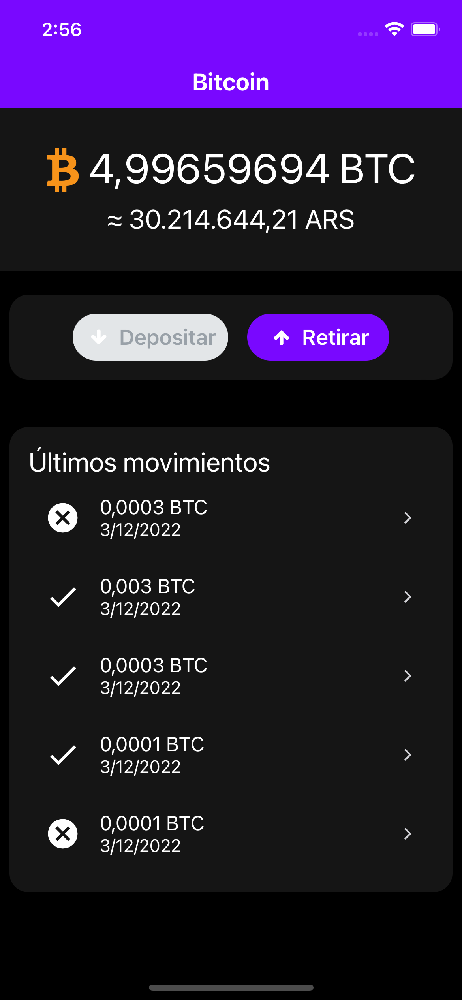

# React Native Challenge App
It is a sample mobile app that simulates BTC withdraws. The user is able to see his balance, simulate withdrawals and see the transactions together with his updated balance based on them.

## Environment
- React Native: `v0.70.6`
- React: `18.1.2`
- React Navigation `v6`

## Setup

1.  Clone 
2.  Run `yarn` in root folder.
3.  Run `cd ios && pod install && ..` in root folder.

## 📱 Run

To run this project use `yarn ios` or `yarn android`

## 🤖 Test

To run tests use `yarn test`.

## Features
- Use of:
   - Typescript
   - ESLint
   - Jest  
   - Husky
   - [Context API](https://reactjs.org/docs/context.html) to manage global app state. If you are interested in use of Redux you can check my other [sample app](https://github.com/mattsff/RN-Challenge-App).
   - [React Native Elements](https://reactnativeelements.com/) to not focus on UI stuff. 
   - [React Navigation](https://reactnavigation.org/)
- Quick implementation to support Dark Mode.
- Basic validations about BTC addresses and available balance. 

## Next steps
- Add Icon & Splash
- Support Localization
- In cashout flow:
   - Add a screen to give feedback about the transaction and allow user to retry if it fails. 
   - Add a screen with the transaction details before confirm it.
   - Show specific error when fee data is not available.
- Optimize remote data update
- Prepare the App to support multiple currencies and networks. 
- Complete with more tests

## Screenshots

